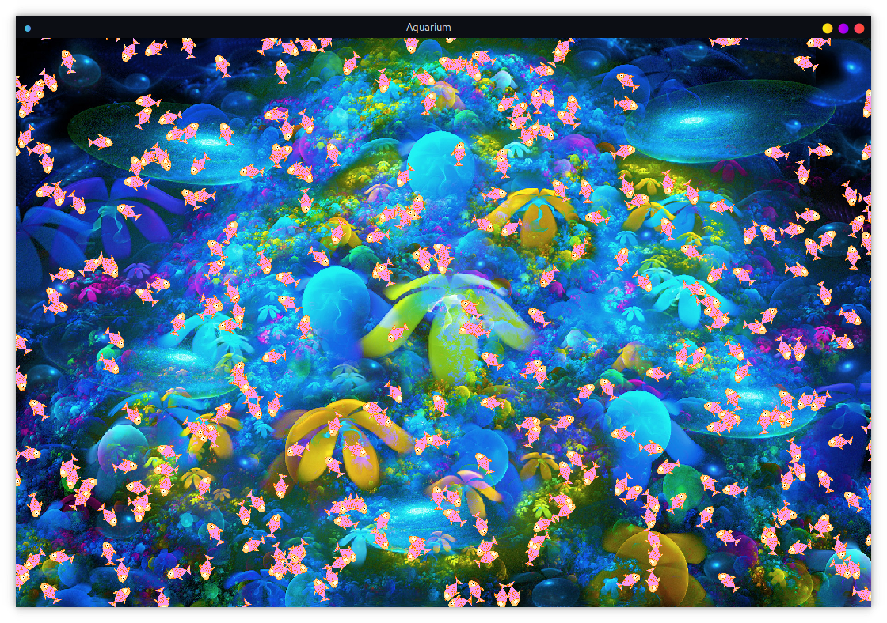

# Aquarium

Now it's just some fishes bouncing from one wall to another in harmonic
motion. 

I'd like to add some sharks that would eat another fishes and teach fishes
to avoid predators, so each organism in the aquarium would be learning how
to survive. I'm not going to hard code fishes gathering in schools
behavior, because maybe they will learn by themselves. 

